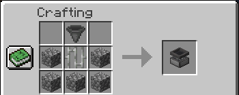
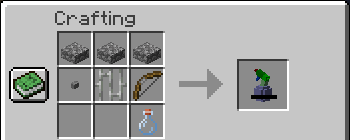
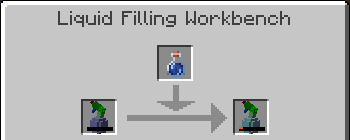
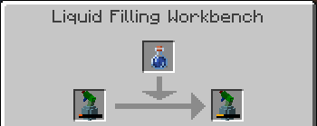
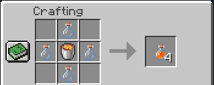
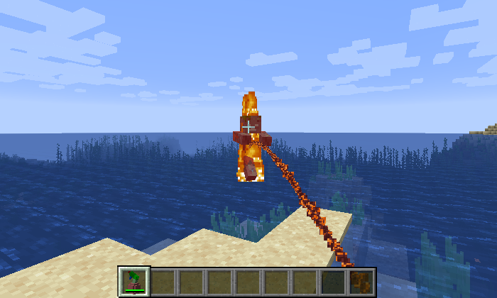

# WaterSprayer（喷雾瓶 Mod）

炎炎夏日，一起感（互）受（相）清（伤）凉（害）吧！

本 Mod 为 TeaCon 2020（<https://www.teacon.org/2020/>）参赛作品。

本 Mod 基于 Minecraft 1.15.2 和 Forge 31.2.0，需要使用 [Scorge 3.0.6 或更高版本](http://files.minecraftforge.net/maven/net/minecraftforge/Scorge/)作为前置。

## 合成配方

首先，合成喷雾瓶液体灌装工作台：

然后合成一个空喷雾瓶：

将空喷雾瓶放入喷雾瓶液体灌装工作台并向其放入一个水瓶就可以得到水喷雾瓶了：

喷雾瓶下方耐久条显示了液体含量，此外，喷雾瓶液体灌装工作台还可用于补充液体：

## 使用方法

喷雾瓶有三种：

* 水喷雾瓶（使用水瓶灌装）：可以使玩家被淋湿
* 熔岩喷雾瓶（使用熔岩瓶灌装）：可以使生物着火并带来伤害
* 蜂蜜喷雾瓶（使用蜂蜜瓶灌装）：可以治疗生物并去除其中毒效果

熔岩瓶为新增加的物品，使用四个玻璃瓶和一桶岩浆合成：

在喷雾瓶灌装好液体后，就可以按住右键喷射了：

## 下载链接

本 Mod 可从 [GitHub Releases](https://github.com/ustc-zzzz/WaterSprayer/releases/latest) 下载，也可在 GitHub 下载[源代码](https://github.com/ustc-zzzz/WaterSprayer/tree/master)后运行 `gradlew.bat build` 或 `./gradlew build` 自行构建。

## 开源协议

本 Mod 属于自由软件，使用 [WTFPL 2.0 协议](https://github.com/ustc-zzzz/WaterSprayer/blob/master/LICENSE)开源。
